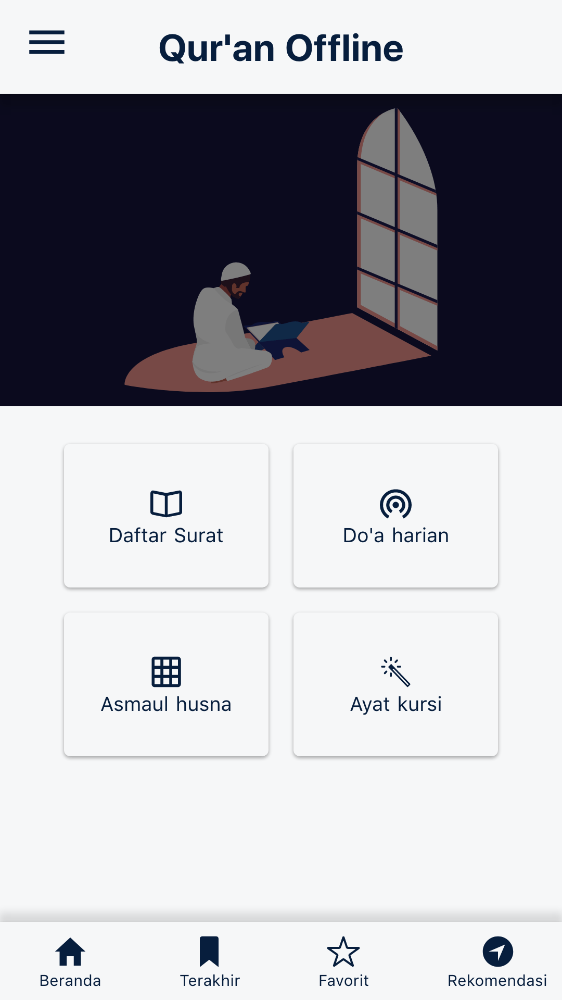
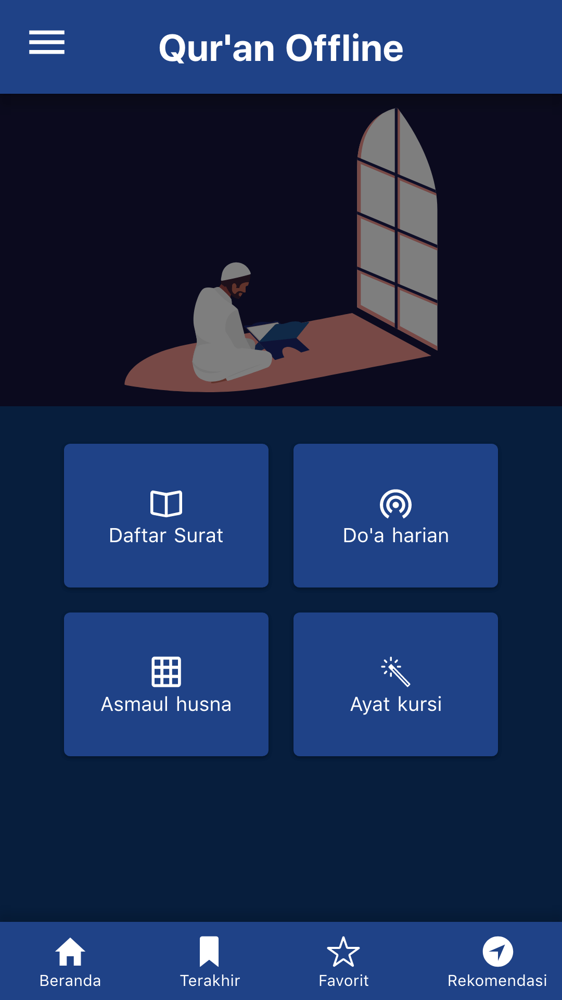
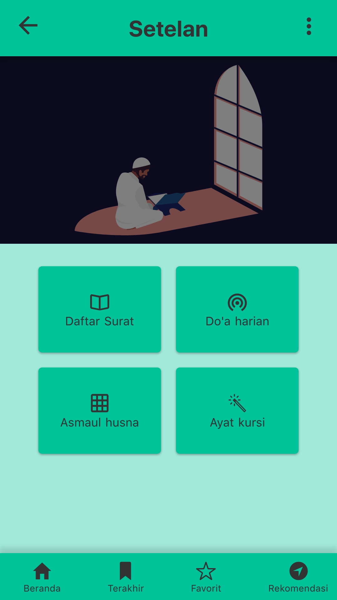

# quran-offline

 
[](#contributors) 

 
[](https://app.netlify.com/sites/quran-offline/deploys)

 
[](https://codecov.io/gh/mazipan/quran-offline) 
[](https://app.codacy.com/app/mazipan/quran-offline?utm_source=github.com&utm_medium=referral&utm_content=mazipan/quran-offline&utm_campaign=Badge_Grade_Settings) 
 

📖 Read Qur'an Directly from Your Web Browser. No Ads, No Analytics, It's Totally Free.

<p align="center">
 
</p>

## Live Website

<https://quran-offline.netlify.app/>

## Screenshoot

|           Home Light Theme           |           Home Dark Theme          |            Home Nature Theme           |
| :----------------------------------: | :--------------------------------: | :------------------------------------: |
|  |  |  |

|              Asmaul Husna              |              Al-Fatihah             |              Do'a Harian              |
| :------------------------------------: | :---------------------------------: | :-----------------------------------: |
|  |  |  |

## Build Setup

This project developed using [Nuxt.js](https://nuxtjs.org/), for complete documentation please take a look into official documentation in <https://nuxtjs.org/>.

```bash
# install dependencies
$ yarn install

# serve with hot reload at localhost:3000
$ yarn dev

# generate static project
$ yarn generate

# run unit test
$ yarn test

# run eslint
$ yarn lint

# run eslint with auto fix
$ yarn lint:fix
```

## Credit

-   Thanks for awesome repo [quran-json](https://github.com/rioastamal/quran-json) by [@rioastamal](https://github.com/rioastamal)
-   Asmaul Husna source from [jagad.id](https://jagad.id/99-asmaul-husna-latin-arab-dan-terjemahan-indonesia-inggris/)

## Icons & Backgrounds

-   Icons made by [Freepik](https://www.flaticon.com/authors/freepik) from [www.flaticon.com](https://www.flaticon.com/free-icon/muslim_2759837)
-   [Ramadhan Icon Pack from Flaticon](https://www.flaticon.com/packs/ramadan-31)
-   [Recite alquran vectors by Vecteezy](https://www.vecteezy.com/free-vector/recite-alquran)
-   [Women pray vector by freepik](https://www.freepik.com/free-vector/flat-design-ramadan-event_7533549.htm)
-   [Ramadhan with man and woman by freepik](https://www.freepik.com/free-vector/ramadan-with-man-woman-praying_7372126.htm)

* * *

Copyright © 2018 by Irfan Maulana

## Contributors

Thanks goes to these wonderful people ([emoji key](https://allcontributors.org/docs/en/emoji-key)):

<!-- ALL-CONTRIBUTORS-LIST:START - Do not remove or modify this section -->

<!-- prettier-ignore -->

<table><tr><td align="center"><a href="https://www.mazipan.xyz/"><br /><sub><b>Irfan Maulana</b></sub></a><br /><a href="https://github.com/mazipan/quran-offline/commits?author=mazipan" title="Code">💻</a> <a href="#maintenance-mazipan" title="Maintenance">🚧</a></td><td align="center"><a href="http://altera.id"><br /><sub><b>azul</b></sub></a><br /><a href="https://github.com/mazipan/quran-offline/issues?q=author%3Aazulkipli" title="Bug reports">🐛</a></td></tr></table>

<!-- ALL-CONTRIBUTORS-LIST:END -->

This project follows the [all-contributors](https://github.com/all-contributors/all-contributors) specification. Contributions of any kind welcome!
