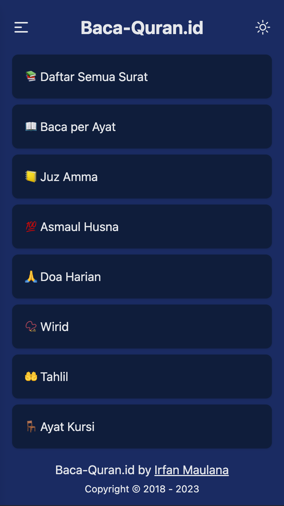
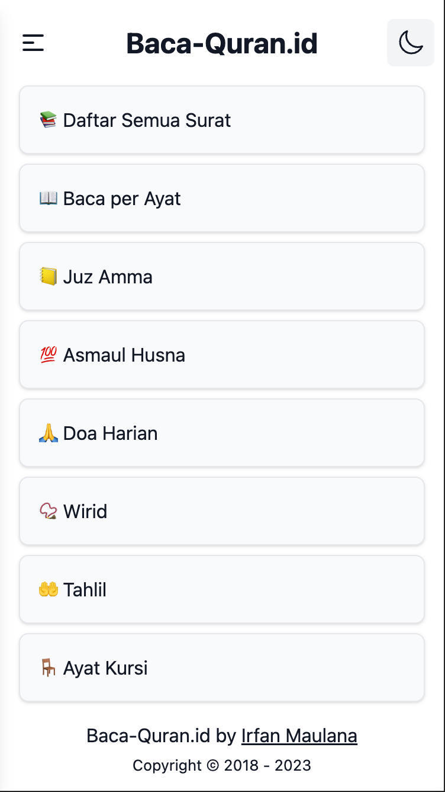
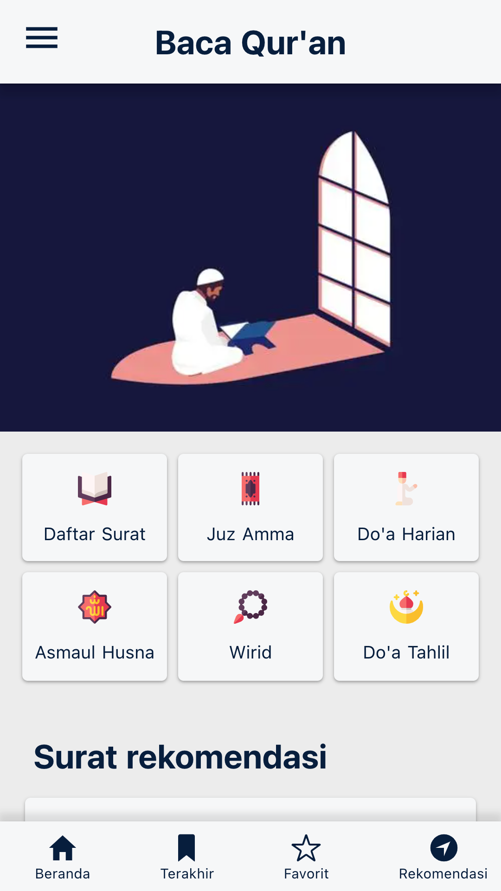
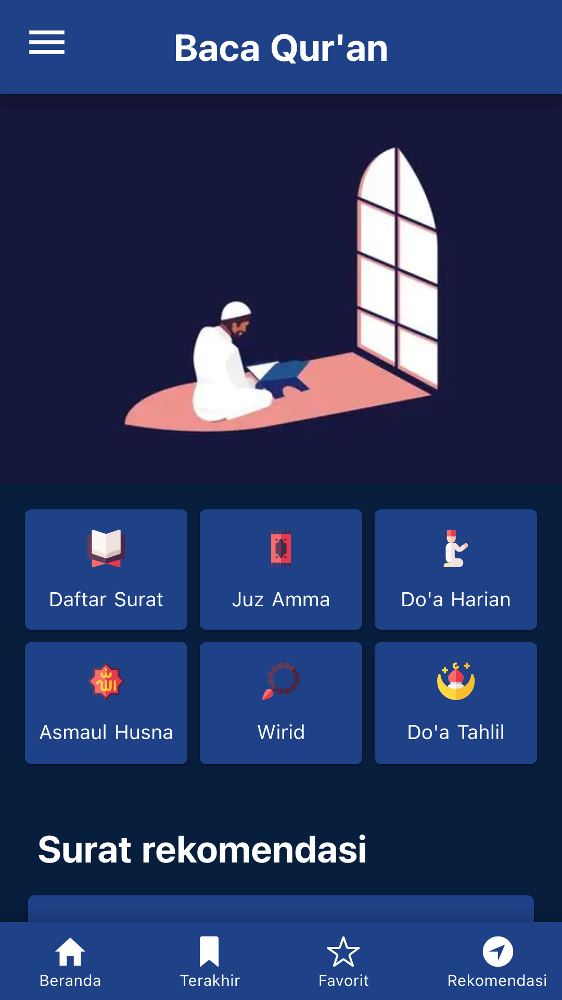
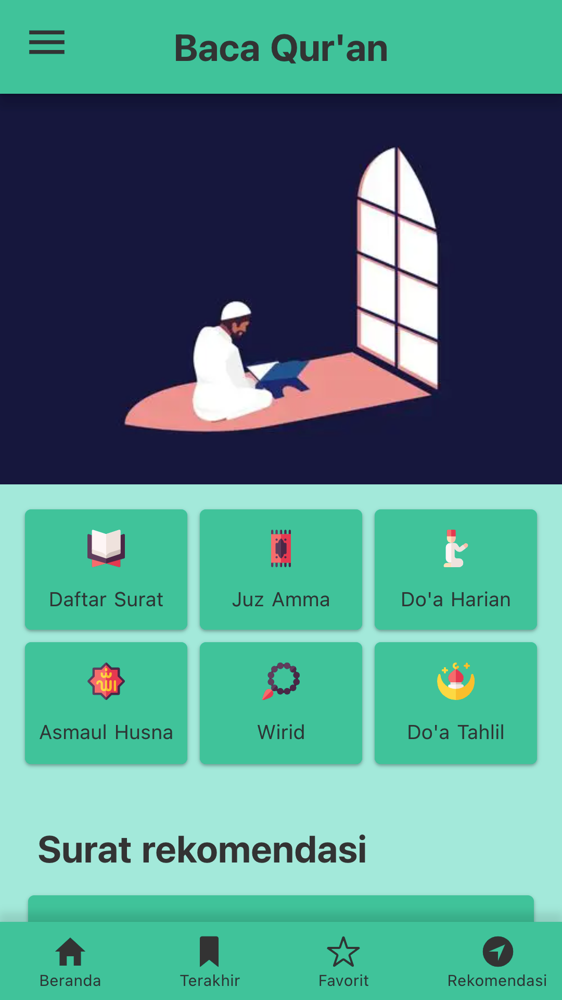
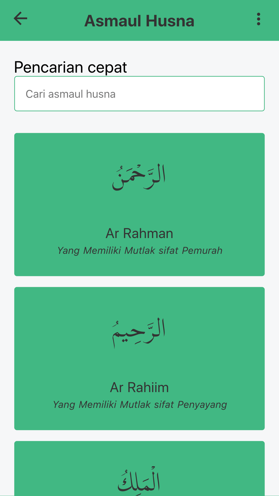

# 📖 Baca-Quran.id


[](#contributors)
[](https://codecov.io/gh/mazipan/baca-quran.id)


Read Qur'an from Your Web Browser. No Ads, No Analytics, It's Totally Free.

## Screenshots

| Home - Dark                                   | Home - Light                                    |
| --------------------------------------------- | ----------------------------------------------- |
|  |  |

## Live Website

<https://www.baca-quran.id/>

## Blog

- Repo: https://github.com/mazipan-quran-offline/tulisan
- Live: https://www.baca-quran.id/tulisan/

## Stories

- Repo: https://github.com/mazipan-quran-offline/stories
- Live: https://www.baca-quran.id/stories/

## Local Setup

```bash
pnpm i
pnpm run dev
```

### Deployment

```bash
pnpm run build
```

Copy `build` folder to your hosting.

## Baca-Quran V1

V1 can be viewed in [`v1`](https://github.com/mazipan/baca-quran.id/tree/v1) branch.

### Screenshots V1

|              Light               |            Blueish             |               Nature               |
| :------------------------------: | :----------------------------: | :--------------------------------: |
|  |  |  |

|                 Asmaul Husna                  |                Al-Fatihah                 |                Do'a Harian                |
| :-------------------------------------------: | :---------------------------------------: | :---------------------------------------: |
|  |  |  |

## Credit

- Thanks for awesome repo [quran-json](https://github.com/rioastamal/quran-json) by [@rioastamal](https://github.com/rioastamal)
- Asmaul Husna source from [islam.nu.or.id](https://islam.nu.or.id/ubudiyah/99-asmaul-husna-dan-artinya-1T8jl)
- Daily Do'a from [doaharianislami.com](http://www.doaharianislami.com/2017/06/kumpulan-doa-sehari-hari-lengkap-dalam-bahasa-arab-latin-dan-artinya.html)
- MP3 Audio from [kemenag.go.id](https://quran.kemenag.go.id/)
- Tahlil from [islam.nu.or.id](https://islam.nu.or.id/post/read/107344/susunan-bacaan-tahlil-doa-arwah-lengkap-dan-terjemahannya)

## Icons & Backgrounds

- Icons made by [Freepik](https://www.flaticon.com/authors/freepik) from [www.flaticon.com](https://www.flaticon.com/free-icon/muslim_2759837)
- [Ramadhan Icon Pack from Flaticon](https://www.flaticon.com/packs/ramadan-31)
- [Recite alquran vectors by Vecteezy](https://www.vecteezy.com/free-vector/recite-alquran)
- [Ramadhan with man and woman by freepik](https://www.freepik.com/free-vector/ramadan-with-man-woman-praying_7372126.htm)
- محمد الحراق, CC BY-SA 4.0 <https://creativecommons.org/licenses/by-sa/4.0>, via Wikimedia Commons

## Support me

- 👉 🇮🇩 [Trakteer](https://trakteer.id/mazipan/tip?utm_source=github-mazipan)
- 👉 🇮🇩 [NihBuatJajan](https://www.nihbuatjajan.com/mazipan?utm_source=github-mazipan)
- 👉 🌍 [BuyMeACoffe](https://www.buymeacoffee.com/mazipan?utm_source=github-mazipan)
- 👉 🌍 [Paypal](https://www.paypal.me/mazipan?utm_source=github-mazipan)
- 👉 🌍 [Ko-Fi](https://ko-fi.com/mazipan?utm_source=github-mazipan)

---

Copyright © 2018 by Irfan Maulana

## Contributors

Thanks goes to these wonderful people ([emoji key](https://allcontributors.org/docs/en/emoji-key)):

<!-- ALL-CONTRIBUTORS-LIST:START - Do not remove or modify this section -->
<!-- prettier-ignore-start -->
<!-- markdownlint-disable -->
<table>
  <tbody>
    <tr>
      <td align="center" valign="top" width="14.28%"><a href="https://www.mazipan.xyz/"><br /><sub><b>Irfan Maulana</b></sub></a><br /><a href="https://github.com/mazipan/baca-quran.id/commits?author=mazipan" title="Code">💻</a> <a href="#maintenance-mazipan" title="Maintenance">🚧</a></td>
      <td align="center" valign="top" width="14.28%"><a href="http://altera.id"><br /><sub><b>azul</b></sub></a><br /><a href="https://github.com/mazipan/baca-quran.id/issues?q=author%3Aazulkipli" title="Bug reports">🐛</a></td>
      <td align="center" valign="top" width="14.28%"><a href="https://github.com/Abizrh"><br /><sub><b>Abizarah &#124; 比周</b></sub></a><br /><a href="https://github.com/mazipan/baca-quran.id/commits?author=Abizrh" title="Code">💻</a></td>
    </tr>
  </tbody>
</table>

<!-- markdownlint-restore -->
<!-- prettier-ignore-end -->

<!-- ALL-CONTRIBUTORS-LIST:END -->

This project follows the [all-contributors](https://github.com/all-contributors/all-contributors) specification. Contributions of any kind welcome!
