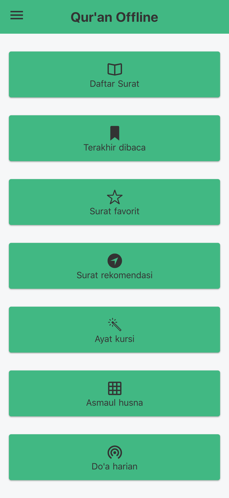

# quran-offline

📖 Read Qur'an Directly from Your Web Browser, No Need Installing Apps Anymore. No Ads, No Analytics, It's Totally Free.

[](https://travis-ci.org/mazipan/quran-offline)
[](https://app.codacy.com/app/mazipan/quran-offline?utm_source=github.com&utm_medium=referral&utm_content=mazipan/quran-offline&utm_campaign=Badge_Grade_Settings) [](https://codecov.io/gh/mazipan/quran-offline) [](https://greenkeeper.io/)

## Live Website

<https://quran-offline.netlify.com/>

## Screenshoot

|                Home Light Theme                |                Home Dark Theme               |                 Home Nature Theme                |
| :--------------------------------------------: | :------------------------------------------: | :----------------------------------------------: |
|  |  |  |

|              Daftar Surat              |              Al-Fatihah             |              Do'a Harian              |
| :------------------------------------: | :---------------------------------: | :-----------------------------------: |
|  |  |  |

## Fitur

-   [x] Daftar seluruh surat
-   [x] Ayat kursi
-   [x] Asmaul husna
-   [x] Akses offline (setelah akses online pertama)
-   [x] Pencarian surat berdasarkan nama
-   [x] Simpan surat favorit
-   [x] Simpan ayat yang terakhir dibaca
-   [x] Rekomendasi beberapa surat populer
-   [x] Tersedia 3 Tema

TODO

-   [ ] Audio

## Build Setup

```bash
# install dependencies
$ yarn install

# serve with hot reload at localhost:3000
$ yarn run dev

# generate static project
$ yarn run generate
```

## Credit

-   Thanks for awesome repo [quran-json](https://github.com/rioastamal/quran-json) by [@rioastamal](https://github.com/rioastamal)
-   Asmaul Husna source from [jagad.id](https://jagad.id/99-asmaul-husna-latin-arab-dan-terjemahan-indonesia-inggris/)

* * *

Copyright © 2018 by Irfan Maulana
